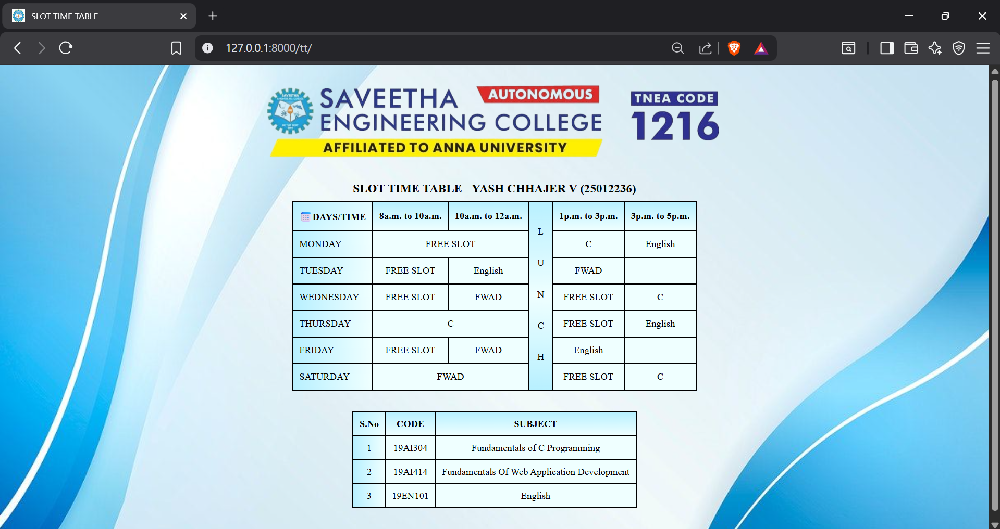

# Ex02 Time Table
# Date:21.11.2025
# AIM
To write a html webpage page to display your slot timetable.

# ALGORITHM
## STEP 1
Create a Django-admin Interface.

## STEP 2
Create a static folder and inert HTML code.

## STEP 3
Create a simple table using `<table>` tag in html.

## STEP 4
Add header row using `<th>` tag.

## STEP 5
Add your timetable using `<td>` tag.

## STEP 6
Execute the program using runserver command.

# PROGRAM

urls.py
```
from django.contrib import admin
from django.urls import path
from slotapp import views

urlpatterns = [
    path('admin/', admin.site.urls),
    path('tt/', views.slot)
]
```

views.py
```
from django.shortcuts import render

def slot(request):
    return render(request,'slot.html')
```

slot.html
```
<html lang="en">
    
<head>
    <title>SLOT TIME TABLE</title>
    <link rel="icon" href="">
    <style>
        body{
            background-image: url(""); 
            background-repeat: no-repeat;
            background-size: cover; 
            background-position: center;
        }
        caption{
            margin-top: 10px;
            margin-bottom: 10px;
            font-weight: bold;
        }
        table,th,td{
            border: 2px solid black;    
            border-collapse: collapse;
            text-align: center;
            padding: 10px;
            margin: auto;
        }
        table{
            background-color: #efffff;
            color: black;
            margin-top: 10px;
        }
        span{
            writing-mode: vertical-rl;
            text-orientation: upright;
            letter-spacing: 35px;
            padding-top:30px;
        }
        img{
            display: block;
            margin-left: auto;
            margin-right: auto;
            width: 50%;
            height: auto;
        }
        .cor {
            background-color: #b8f0ff;
        }
        .cor th{
            background: linear-gradient(180deg, #b8f0ff, #efffff);
        }
        .hd {
            background-color: #b8f0ff;
            text-align: left;
            background: linear-gradient(90deg, #b8f0ff, #efffff);
        }
        .num{
            background: linear-gradient(90deg, #b8f0ff, #efffff)
        }
        .info {
            width: auto; 
            margin-top: 35px;
            margin-bottom: 50px;
            color: black;
        }
        .info th {
            background: linear-gradient(180deg, #b8f0ff, #efffff);
        }

        .info td {
            background-color: #efffff;
        }
    </style>
</head>
<body>
    
    <table>
        <caption style="color: black; font-size: 20px;">SLOT TIME TABLE - YASH CHHAJER V (25012236)</caption>
        <tr class="cor">
            <th style="background: linear-gradient(135deg, #b8f0ff, #efffff)">📅DAYS/TIME</th>
            <th>8a.m. to 10a.m.</th>
            <th>10a.m. to 12a.m.</th>
            <td rowspan="7" style="background: linear-gradient(180deg,#b8f0ff, #efffff,#b8f0ff)"><span>LUNCH</span></td>
            <th>1p.m. to 3p.m.</th>
            <th>3p.m. to 5p.m.</th>
        </tr>
        <tr>
            <td class="hd">MONDAY</td>
            <td colspan="2" bgcolor="#efffff">FREE SLOT</td>
            <td>C</td>
            <td>English</td>
        </tr>
        <tr>
            <td class="hd">TUESDAY</td>
            <td bgcolor="#efffff">FREE SLOT</td>
            <td>English</td>
            <td>FWAD</td>
            <td bgcolor="#efffff"></td>
        </tr>
        <tr>
            <td class="hd">WEDNESDAY</td>
            <td bgcolor="#efffff">FREE SLOT</td>
            <td>FWAD</td>
            <td bgcolor="#efffff">FREE SLOT</td>
            <td>C</td>
        </tr>
        <tr>    
            <td class="hd">THURSDAY</td>
            <td colspan="2">C</td>
            <td bgcolor="#efffff">FREE SLOT</td>
            <td>English</td>
        </tr>
        <tr>
            <td class="hd">FRIDAY</td>
            <td bgcolor="#efffff">FREE SLOT</td>
            <td>FWAD</td>
            <td>English</td>
            <td bgcolor="#efffff"></td>
        </tr>
        <tr>
            <td class="hd">SATURDAY</td>
            <td colspan="2">FWAD</td>
            <td bgcolor="#efffff">FREE SLOT</td>
            <td>C</td>
        </tr>
    </table>
    <table class="info">
        <tr>
            <th style="background: linear-gradient(135deg, #b8f0ff, #efffff)">S.No</th>
            <th>CODE</th>
            <th>SUBJECT</th>
        </tr>
        <tr>
            <td class="num">1</td>
            <td>19AI304</td>
            <td>Fundamentals of C Programming</td>
        </tr>
            <td class="num">2</td>
            <td>19AI414</td>
            <td>Fundamentals Of Web Application Development</td>
        </tr>   
        <tr>
            <td class="num">3</td>
            <td>19EN101</td>
            <td>English</td>
        </tr>
    </table>
</body>
</html>
```
# OUTPUT


# RESULT
The program for creating slot timetable using basic HTML tags is executed successfully.
